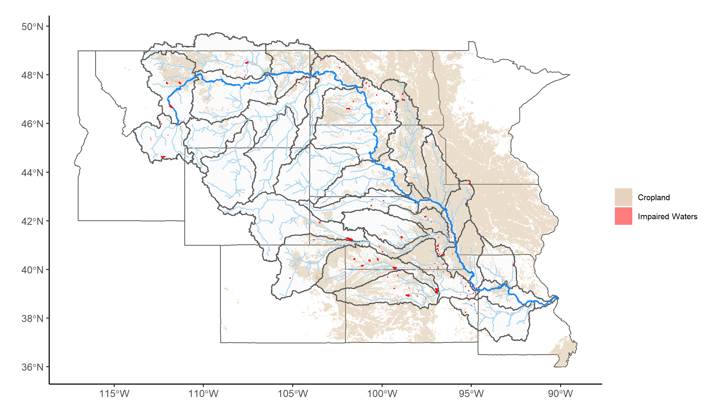
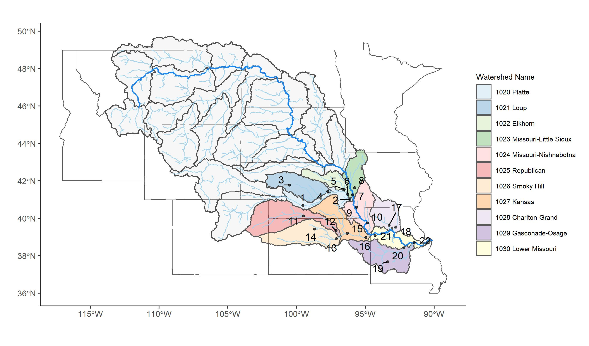
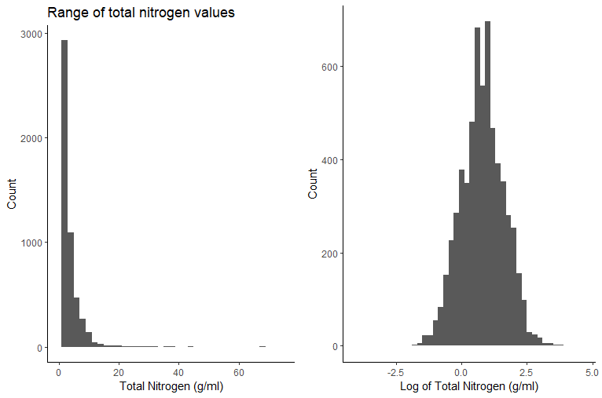
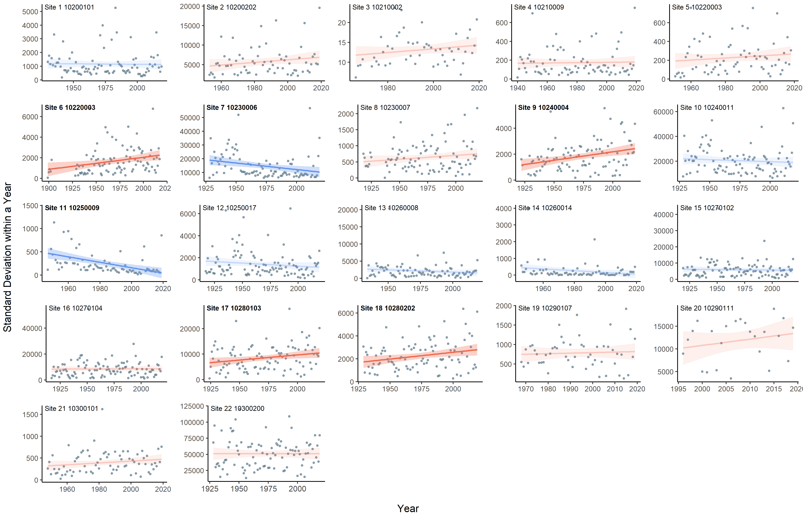

\newpage


```{r setup, include=FALSE}
knitr::opts_chunk$set(message=FALSE, warning=FALSE, echo=FALSE, fig.pos="H")
# Set your working directory
getwd()

# Load your packages
library(tidyverse)
library(kableExtra)
library(dataRetrieval)
library(dplyr)
library(xts)
library(dygraphs)
library(lubridate)
library(gridExtra)
library(cowplot)
library(trend)
library(forecast)
library(tseries)
library(jpeg)
library(grid)
library(gridExtra)
library(ggpubr)
require(pander)

# Set your ggplot theme

theme_set(theme_classic())

# Load your datasets


```

# Rationale and Research Questions

The Missouri River is the largest river in North America (2,540 miles) and has the second largest watershed (529,000 mi^2^/339 acres, U.S.-Canada, [@kammerer1990]). Its watershed covers portions of ten states, which account for approximately one-sixth of the continental United States, as well as a small part of Canada [@usace2018]. The headwater is located in the Bitterroot Mountains River of northwestern Wyoming and southwestern Montana [@nrc2002]. Demands for managing the river for the benefit of human livelihood has resulted in drastic modification in the river and the floodplains. Numerous reservoirs and dams have been constructed, of which six major dams were built on the mainstream[@nrc2002]. Now, the river is used intensively in multiple ways, including municipal, agricultural, hydropower, recreation, flood control etc. [@bor2016-1].

Within the 328 million acres of the basin’s total area in the United States, 64.2% (218 acres) are related to agricultural uses, while the rest dedicated for recreation, fish and wildlife, and urban [@bor2016-1; @usace2018]. 37.1% of the total basin area is pasture and range grassland primarily for grazing, and cropland consists of almost 92 million acres [@usace2018]. As of 2012, irrigated land comprises 14.2 million acres, and required a delivery of about 13 million acre-feet of surface water annually [@usace2018]. Wetlands and Water bodies, on the other hand, cover 3.7 and 1.8 million acres, respectively [@usace2018]. In spite of the low proportion of water areas (2.3%), they are the pivotal foundation for agricultural or other usages, and thus critical to the whole region’s economy. 

Along with the agricultural, urban, and industrial development in the region is nutrient loading and enrichment in water bodies, especially for nitrogen (N) and phosphorus (P). Agricultural input through fertilizer is the predominant anthropogenic source for nutrient in water bodies in the whole basin [@nrc2002]. Regardless of the major anthropogenic source, nutrient enrichment is considered nationally as one of the leading factors for water quality impairment. According to USEPA 303(d) lists, more than 160 stream reaches, lakes, or reservoirs were reported by USEPA to suffer nutrient-related impairment in 2006 [@nrc2002].

In addition to change in nutrient concentration, discharge appears to be highly variable in the basin, and both severe drought and flooding events occurred in the basin in the past. For example, in the spring and summer of 2011, an unprecedented flooding event caused over \$2 billion damage and 5 fatalities, leading to FEMA disaster declaration made in all states along the Missouri River [@noaa2012]. During the flooding event, around 11,000 people evacuated Minot, North Dakota owing to high water level in Souris River, which flooded 4,000 homes [@noaa2012]. In 2012, a drought even struck the Central Great Plain, including the basin, and inflicted at least \$12 billion of loss before July, 2012 [@noaa2013]. Recently, another flooding event occurred in the spring of 2019. 

Given all the background information above, we would like to know the current state of Missouri River and its tributaries, with a focus on the changing patterns in discharge and nutrient levels. Water bodies along the downstream are more likely to be impaired by nutrients accumulated from the upstream, and more croplands and pastures which can further load nutrients into streams are distributed in the lower basins (\autoref{fig:cropland}). Therefore, in the present project, study sites were concentrated in the southeast of the whole Missouri Basin. By analyzing data retrieved from these sites, we first revealed the general yearly discharge pattern and changes in variability over years. Then we investigated how the dramatic change in discharge (i.e. water quantity) could potentially interact with nutrient enrichment (i.e. water quality). We examined a few specific flooding and drought events, during which changes in both water quality and quantity were well recorded, so that we could make inference on the interplay between quantity and quality. The effect of population on nutrient enrichment was also examined to illustrate potential non-agricultural impact from human activities. Finally, based on the pattern in the past and the best model we could fit, we attempted to predict the likely future conditions and trends in the Missouri River Basin. Our research questions and acccompanying hypotheses are below:

```{r cropland, out.width="\\maxwidth", fig.cap="\\label{fig:cropland} Map of agricultural lands and impaired waters in the Missouri River Basin. Row and Close Grain Crop Cultural Formation shown by tan-colored areas, pasture and hay field shown by yellowgreen areas, imparied water bodies according to Clean Water Act Section 303(d) (EPA 2015) denoted by red areas, and all HUC4 watersheds in the Missouri River Basin (1001-1030) delineated by gray polygons. The thin light-blue lines outline all streams of a Strahler order higher than 2, and the thick blue line represents the mainstem of Missouri River."}

```
1. How have changes in discharge (i.e. water quantity) interacted with nutrient enrichment (i.e. water quality) in the Missouri River Basin?

    a) Nutrient levels have increased over time - Keqi
    b) Discharge has become more variable over time - Hubert
    c) Nutrient levels increase with discharge - Rachel
  
 
2. What effects do specific flood and drought events have on the water quality and quantity of rivers in the Missouri River Basin areas of interest?

    a) Rivers will exhibit a flushing behavior due to the land use and type of flow during storms - Rachel
    b) Discharge will decrease during drought due to decreased overland flow. - Caroline
    
3. What factors contribute to the variability of total nitrogen in the rivers?

    a) Land use, year, discharge, phosphorus, and HUC region will contribute to the variability of total nitrogen across sites - Rachel

4. Given past and current data, what can we predict about the future state of water in the Missouri River Basin?

    a) Total flow in the Missouri River Basin is decreasing (non-stationary) over time - Keqi
    b) The future situation of the river basin will see the continuation of current trends of decreasing overall volume of flow. - Keqi

\newpage

# Dataset Information

The data we are analyzing comes from the United States Geological Survey (USGS) database called the National Water Information System interface, or NWIS. We pulled data from the interface using the R package `dataRetrieval`. Because we are interested in the lower Missouri River basin, we pulled sites from each HUC4 subbasin from 1020 to 1030. We chose these subbasins because they had a variety of tributaries that all flowed into the Missouri River, representing a variety of river sizes and lengths. We filtered these subbasin queries to only show us sites that contained discharge, nitrogen, and phosphorus data. Once we found the sites with all of this data, we chose 2 sites from each HUC sub basin for a total of 22. We chose the two sites from each HUC sub basin by comparing the periods of records for each of our chosen variables and finding the sites with the longest periods of records. We chose to look at two sites per HUC region (for a total of 22) in order to maintain a digestable scope. We retrieved data on water quantity, water quality (N, P concentrations) (Table 1).

Only seven sites within our HUC subbasin boundary contained any high frequency nitrogen data. Therefore, we also looked at these 6 sites in order to do analyses and answer our research question about flooding. Since flooding and droughts can be thought of as opposites, we looked at the same 6 sites for droughts as we did for flooding (Table 2). 

We have two main datasets:

- The daily values dataset containing discharge, nitrogen, and phosphorus data for 22 sites. 

- The high freqency dataset containing high frequency data for nitrogen and discharge for 6 sites.

Variable   |   Unit  |   Number of Sites   |   
----------- | :---------------: | --------------- |
Discharge  | cfs or $m^{3}$/s | 22 
Time | UTC | 22
Nitrogen | mg/L | 22 with daily values, 6 with high frequency values
Phosphorus | mg/L | 22

<Add a table that summarizes your data structure (variables, units, ranges and/or central tendencies, data source if multiple are used, etc.). This table can be made in markdown text or inserted as a `kable` function in an R chunk. If the latter, do not include the code used to generate your table.>

```{r sitemap, out.width="\\maxwidth", fig.cap="\\label{fig:sitemap} Map of USGS sites used for long term analysis."}

```

\newpage

# Exploratory Analysis 

## Exploration of variables

Basic data wrangling was needed in order to obtain all variables of interest. After obtaining all pertinent data, each variable was visualized in order to see the shape of the data and the range of values (\autoref{fig:Nhist}). Any necessary transformation or cleaning was completed after this step.

```{r Nhist, out.width="\\maxwidth", fig.cap="\\label{fig:Nhist} Histograms showing the range of total nitrogen values obtained from all sites during the total period of record. Raw (left) and logged (right) nitrogen data are shown to show that any analysis requiring normally distributed data will use the log transformed nitrogen data."}

```

Discharge, nitrogen, and phosphorus were plotted for each site and examined together in order to see if there were any obvious patterns or trends (\autoref{fig:dataexample}).

```{r dataexample, echo=FALSE, warning=FALSE, out.width="\\maxwidth", fig.cap="\\label{fig:dataexample} Discharge, Nitrogen, Phosphorus daily data of site No. 22 Missouri River At Hermann, MO."}

## Discharge
MRHDischarge <- readNWISdv(siteNumbers = "06934500",
                             parameterCd = "00060", # discharge (ft3/s)
                             startDate = "",
                             endDate = "")
names(MRHDischarge)[4:5] <-c("Discharge", "Approval.Code")

# Plot discharge over time
MRHPlot <- 
  ggplot(MRHDischarge, aes(x = Date, y = Discharge)) +
  geom_line() +
  labs(x = "", y = expression("Discharge (ft"^3*"/s)"), 
        title = "  22 Missouri River At Hermann, MO") + 
  xlim(as.Date(c("1928-01-01", "2020-01-01"))) 
  par(pin = c(50,40))

## Nitrogen
MRHNitrogen <- readNWISqw(siteNumbers = "06934500",
                            parameterCd = "00600", # nitrogen (mg/L)
                            startDate = "",
                            endDate = "") %>%
  select(sample_dt, result_va)

# What do these data look like?
MRHN <-
  ggplot(MRHNitrogen, aes(x = sample_dt, y = result_va)) +
  geom_point()

# Remove outliers
MRHNitrogen <- MRHNitrogen %>%
  filter(result_va < 10) %>%
  arrange(sample_dt)

# Re-plot data
MRHN <-
  ggplot(MRHNitrogen, aes(x = sample_dt, y = result_va)) +
  geom_line() +
  labs(x = " ", y = expression("nitrogen (mg/L)")) +
  xlim(as.Date(c("1928-01-01", "2020-01-01"))) 

## Phosphorus
MRHPhosphorus <- readNWISqw(siteNumbers = "06934500",
                              parameterCd = "00665", # phosphorus (mg/L)
                              startDate = "",
                              endDate = "") %>%
  select(sample_dt, result_va)

# What do these data look like?
MRHP <-
  ggplot(MRHPhosphorus, aes(x = sample_dt, y = result_va)) +
  geom_point()

# Remove outliers
MRHPhosphorus <- MRHPhosphorus %>%
  filter(result_va < 3) %>%
  arrange(sample_dt)

# Re-plot data
MRHP <-
  ggplot(MRHPhosphorus, aes(x = sample_dt, y = result_va)) +
  geom_line() +
  labs(x = "Date", y = expression("phosphorus (mg/L)"))  +
  xlim(as.Date(c("1928-01-01", "2020-01-01"))) 

ggarrange(MRHPlot, MRHN, MRHP
          + font("x.text", size = 10), ncol = 1, nrow = 3)
```

## Yearly Discharge Pattern

Typical discharge patterns within a year for each HUC4 watershed from 1020 to 1030 were generated by compiling all available discharge data at the 22 selected USGS site (\autoref{fig:dispattern}). Generally, discharge reaches its peak during the summer and falls to minima during the winter, and most of the sites exhibit rather high variations across years, as indicated by the large difference between the medians and the first or the third quartiles. Furthermore, highest variations in discharge appear to occur in the summer, whereas discharge in the winter varies less among years. The large variability within a year and the seasonal pattern is only obvious in larger streams and rivers but not in small creeks (e.g. site 5 Maple Creek near Nickerson, site 8 Boyer River, site 21 Small Blue River). 
Exceptions to the generalization are three sites with medium discharge (site 1 Platte River, NE; site 3 Dismal River, NE; site 11 Republican River, NE). They have fairly constant discharge and variation across years, and the the first and the third even have slightly lower discharge during the summer. Platte River forms by the confluence of North Platte and South Platte Rivers, and both two have snowmelt as their water source, resulting in the observed higher discharge during the spring and low in the summer. Dismal River forms by two forks that arise from groundwater (Ogallala Aquifer), which is supposed to be more stable than precipitation. The majority of Republican River basin is underlain by Ogallala Aquifer [@bor2016-2], and a plausible high proportion of water source from groundwater could explain the little variation across years.

```{r dispattern, out.width="\\maxwidth", fig.cap="\\label{fig:dispattern}Yearly discharge pattern for the lower Missouri HUC4 watersheds. Thick, dark lines are the median of all discharge records on a day of year, while light, thin, dashed lines are the 25th and 75 discharge quantiles on that day. The blue lines represent the first site in a HUC4 watershed, while the green lines represent the second site."}
knitr::include_graphics('../Figures/discharge.jpg')
```

## Change in Discharge Variations over Years
To reveal how variability of discharge has changed over time, we analyzed the relationship between standard deviation of discharge within a year and years, using linear models (\autoref{fig:varfig}; \autoref{tab:vartab}). Among all the 22 sites, 14 sites suggest increasing SD over time, and 4 of them show statistically significant increase. By contrast, only 8 sites suggest declining SD trends, and 2 of them exhibit statistically significant rising in SD. Despite that only data from six sites (around 27%) yield conclusive results, within these sites the number of streams that have become more variable are two times as many as those with decreasing variability. Thus, our results suggest that the whole Missouri Basin appear to have become more variable over years since around the mid-19th century. The low percentage of significant results could result from the small effect size, and/or the short time span of available data for some sites. Hence, more monitoring on discharge in the basin are required in the future to reach a more definitive conclusion.

```{r varfig, echo=FALSE, warning=FALSE, out.width="\\maxwidth", fig.cap="\\label{fig:varfig} Changes in the standard deviations (SD) of discharge within a year at 22 sites over the whole time span of available data. Red regression lines and confidence intervals suggest increasing SD, whereas blue for decreasing SD over time. Bolded site labels and HUC8, and colors with higher saturation indicate statistically significant results ($\\alpha = 0.05$)."}

```

```{r vartab, echo=FALSE, eval=TRUE, results="asis"}
var.table <- read.csv("../Data/Processed/sd_year.csv")

panderOptions("digits", c(1, 0, 4, 3, 3))
panderOptions("table.split.table", Inf)
emphasize.strong.rows(which(var.table$p < 0.05, arr.ind = TRUE))
set.alignment(c("right", "centre", "center", "center", "center"))

pandoc.table(var.table, style = 'rmarkdown', 
             col.names = c("","Site Name", "HUC4","$\\beta_1$","*P*"),
             caption = "\\label{tab:vartab} Slopes of linear regression between year and standard deviation of discharge at 22 sites.")
```

# Analysis

<Insert visualizations and text describing your main analyses. Format your R chunks so that graphs are displayed but code and other output is not displayed. Instead, describe the results of any statistical tests in the main text (e.g., "Variable x was significantly different among y groups (ANOVA; df = 300, F = 5.55, p < 0.0001)"). Each paragraph, accompanied by one or more visualizations, should describe the major findings and how they relate to the question and hypotheses. Divide this section into subsections, one for each research question.>

<Each figure should be accompanied by a caption, and each figure should be referenced within the text>


## Question 1:  How have changes in discharge interacted with nutrient enrichment in the Missouri River Basin?

We analyzed discharge, nitrogen and phosphorus trends at 22 sites using daily value data. The results are listed in the following table. In our analysis, discharge of 18 sites increase while 4 sites show the decreasing trend of discharge. However, these four sites all locate in HUC 1025 and 1026, away from the main stem of the Missouri River. Therefore, overall, the discharge in Missouri River is increasing.
The trend of nitrogen and phosphorus concentration of 22 sites are quite different. But generally, the trend of nitrogen and the trend of phosphorus are similar, which indicates that there is high possiblity that nitrogen and phosphorus come from the same sources. If we focus on the sites located at the main stem of the Missouri River (06610000 Missouri River at Omaha, NE; 06818000 Missouri River at St. Joseph, MO; 06934500 Missouri River at Hermann, MO), we can see significant increasing trend of nitrogen and phosphorus. The water quality in Missouri River is still deteriorating and protection is urgently needed.

Site Name    |   Site Number   |  Discharge Trend  |  Discharge Trend Significance  |   Nitrogen Trend  |  Nitrogen Trend Significance  |   Phosphorus Trend    |  Phosphorus Trend Significance   |
:-------------:|:-----------------:|:-------------------:|:--------------------------------:|:-------------------:|:------------------------------------------:|:---------------------:|:--------------------------------:|
Platte River near Overton, Nebr.  |  06768000  |  Increase  |    |  Decrease  |  *  |  Decrease  |  ***  |
Platte River at Louisville, Nebr.  |  06805500  |  Increase  |  ***  |  Increase  |  ***  |  Increase  |  ***  |
Dismal River near Thedford, Nebr.  |  06775900  |  Increase  |  ***  |  Decrease  |  ***  |  Decrease  |    |
Beaver Creek at Genoa, Nebr.  |  06794000  |  Increase  |    |  Increase  |    |  Increase  |    |
Maple Creek near Nickerson, Nebr.  |  06800000  |  Increase  |  ***  |  Increase  |  ***  |  Increase  |  ***  |
Elkhorn River at Waterloo, Nebr.  |  06800500  |  Increase  |  ***  |  Increase  |  *  |  Increase  |    |
Missouri River at Omaha, NE  |  06610000  |  Increase  |  ***  |  Increase  |  **  |  Increase  |  ***  |
Boyer River at Logan, IA  |  06609500  |  Increase  |  ***  |  Decrease  |    |  Increase  |    |
Nishnabotna River above Hamburg, IA  |  06810000  |  Increase  |  ***  |  Decrease  |    |  Increase  |    |
Missouri River at St. Joseph, MO  |  06818000  |  Increase  |  ***  |  Increase  |  .  |  Increase  |    |
Republican River near Orleans, Nebr.  |  06844500  |  Decrease  |  ***  |  Increase  |  .  |  Decrease  |  **  |
REPUBLICAN R AT CLAY CENTER, KS  |  06856600  |  Decrease  |  **  |  Decrease  |  **  |  Decrease  |  ***  |
SMOKY HILL R AT ENTERPRISE, KS  |  06877600  |  Decrease  |    |  Decrease  |  .  |  Increase  |    |
SF SOLOMON R AT OSBORNE, KS  |  06874000  |  Decrease  |  .  |  Decrease  |  ***  |  Decrease  |  ***  |
KANSAS R AT WAMEGO, KS  |  06887500  |  Increase  |    |  Increase  |  ***  |  Increase  |  ***  |
KANSAS R AT DESOTO, KS  |  06892350  |  Increase  |  .  |  Increase  |  **  |  Increase  |  ***  |
Grand River near Sumner, MO  |  06902000  |  Increase  |  *  |  Decrease  |  ***  |  Increase  |    |
Chariton River near Prairie Hill, MO  |  06905500  |  Increase  |  *  |  Decrease  |    |  Increase  |    |
Pomme de Terre River near Polk, MO  |  06921070  |  Increase  |    |  Decrease  |  .  |  Decrease  |    |
Osage River below St. Thomas, MO  |  06926510  |  Increase  |    |  Decrease  |  ***  |  Increase  |  ***  |
Little Blue River near Lake City, MO  |  06894000  |  Increase  |  **  |  Decrease  |  ***  |  Decrease  |  ***  |
Missouri River at Hermann, MO  |  06934500  |  Increase  |  ***  |  Increase  |  ***  |  Increase  |  ***  |

Note:
*** p-value < 0.001 
** 0.001 <= p-value < 0.01
* 0.01 <= p-value < 0.05 
. 0.05 <= p-value < 0.1 
otherwise  0.1 <= p-value < 1 

## Question 2: What effects do specific flood and drought events have on the water quality and quantity of rivers in the Missouri River Basin areas of interest?

### Flooding

Population of each county (from the 2010 census) in the four states that make up our region area of interest (Kansas, Nebraska, Missouri, and Iowa) were found using the "counties" database from R's `noncensus` package. We decided that population could be used as a proxy for land cover, as a greater population would indicate more development and fewer agricultural fields or open spaces. 

Baseflow and quickflow from each site were determined with the `EcoHydRology` package. After linearly interpolating the instantaneous discharge data in order to account for gaps, total baseflow volume was found and the percent of discharge exported as baseflow was calculated. We predicted that a site within a county with a large population would have a lower percent of its discharge exported as baseflow, because quickflow would be more common in areas with a lot of development. Similarly, we also predicted that a site within a county with a small population would have a greater percentage of its discharge coming from baseflow. More developed areas often have flashier floods, and so we were curious to see whether we can relate population to an element of flashiness - the percentage of discharge exported as quickflow.

Contrary to our hypotheses, greater county population does not contribute to a decrease in percent of discharge as baseflow (p = 0.4199, F = 0.8067) in our sites of interest. This may be due to our small sample size of sites, or perhaps the size of the rivers in our study.

High frequency nitrogen data was only available for seven sites within our region. In order to better understand the behavior of rivers during floods, we examined dygraph plots of discharge and nitrogen, and created hysteresis plots. Storms from the fall of 2018 (September - December)  were examined for each river site with data from that time period. We chose to only look at storms that occurred in the second half of the year in order to avoid conflating snowpack melt and precipitation affects. 

We predicted that most rivers in the area would behave the same way, and that rivers would exhibit flushing behavior. We thought that flushing rivers would be more prevalent because of the many agricultural fields in our region of study, and any overland flow to the rivers would bring with it a high concentration of nutrients (nitrogen being one of them) from the fertilized fields. Our results say otherwise (Table 2). Our sites of interest had both positive and negative slopes in the hysteresis plots, and also exhibited both clockwise and counter clockwise directions of flow (\autoref{fig:Randolphstorm}). The same river was analyzed multiple times throughout the year, and even the same river showed different slopes and directions in the hysteresis plots for different storm events. 

Site Name   |   Site Number   |   Time Period   |   Direction   |  Slope
----------- | :---------------: | --------------- | ------------- | ---------
West Nishnabotna River in Randolph, IA | 06808500  | Oct 7 - 13, 2018 | counter clockwise | negative (\autoref{fig:Randolphstorm})
Nodaway River at Clarinda, IA  | 06817000 | Oct 8 - 12, 2018 | clockwise | negative
Kansas River in Desoto, KS  | 06892350 |   Nov 30 - Dec 5, 2018 | counter clockwise | positive
Missouri River at Hermann, MO  | 06934500  |  Oct 7 - 20, 2018  | counter clockwise | negative
Mill C at Johnson Drive, Shawnee, KS  | 06892513 | Nov 27 - Dec 4, 2018 | clockwise | negative
Grand River, Sumner MO  | 06902000 |  Sep 6 - 10, 2018 | clockwise | positive


```{r Randolphstorm, echo=FALSE, fig.cap = "Hyteresis plot for site in Randolph, IA that shows a negative slope (diluting behavior) in a counter clockwise direction."}
Randolph <- read.csv("../Data/Processed/Randolph.csv", as.is=TRUE)


RandolphStorm <- Randolph %>%
  filter(dateTime > "2018-10-07" & dateTime < "2018-10-13") 
RandolphStorm$dateTime <- as.Date(RandolphStorm$dateTime)


RandolphStorm.plot <- ggplot(RandolphStorm, aes(x = Flow_Inst, y = Nitrate_mgl, 
                                                color = dateTime)) +
  geom_point() +
  labs(x="Discharge (cfs)", y= "Nitrogen mg/l)", color="Date", 
       title="West Nishnabotna River in Randolph, IA")
print(RandolphStorm.plot)
```

### Droughts
Droughts in the Missouri River Basin were known to occur throughout the years and six sites were analyzed for drought information. The six sites were chosen based off what was examined for floods. 

Drought was defined as determining the 7Q10, which is the minimum 7-day average flow that will occur every 10 years (probability of 10%) (EPA, 2019). The 7Q10 measurement is used to determine streamflow limits, allocate water resources, dilution rates in watersheds, and more (USGS, 2019). 7Q10 is calculated by determining the recurrence interval, which is the past recurrence of an event, which for droughts would be the minimum 7-day average discharge. The recurrence interval can then be used to calculate the probability, which would be the probability or likelihood of having a minimum 7-day average flow of this magnitude or greater. In this case, the minimum 7-day average flow that has a 10% chance of going below that  value in a given year. 

The recurrence interval is calculated using the following equation: 

$$T = (n+1)/m$$

where T is the recurrence interval, n is the number of years of data, and m is the ranking of the event within the years of data.

Exceedance probability is calculated to determine the probability of having a discharge event of a given size or greater in a year. The equation is: 

$$P = 1/T$$

where P is the exceedance probability, and T is the recurrence interval. 

The 7Q10 was calculated for each of the six sites by first filtering the discharge data to only include the selected site. The ‘rollmean’ function was then used to calculate the average flow every 7 days for said site. Once the 7-day average flow was calculated, the data was grouped by the year so that it could then be summarized to obtain the minimum 7-day average flow. After grouping and summarizing the data, there was one value, the minimum 7-day average flow, for each year of data obtained. From here, the recurrence interval and probability were calculated in each data frame. 

The 7Q10 value was then determined from the probability column by filtering the data to show the minimum 7-day average discharge with probability less than or equal to 0.1 (Table 3).


**Table x:** WRITE caption summarizing the 7Q10 values for each of the streams that were analyzed for droughts.

Site Name   |   Site Number   |  7Q10 Minimum Discharge (cfs)  |     
----------- | --------------- | ------------------------------ |
West Nishnabotna River in Randolph, IA | 06808500  | 41.3
Nodaway River at Clarinda, IA  | 06817000 | 5.93
Kansas River in Desoto, KS  | 06892350 | 562   
Missouri River at Hermann, MO  | 06934500  | 12414
Mill C at Johnson Drive, Shawnee, KS  | 06892513 | 1.47
Grand River, Sumner MO  | 06902000 | 39.1  

In addition to calculating the 7Q10 values for the 6 sites, the sites were analyzed to determine the 7-day moving average flow over a period of years. The 25th, 50th, and 75th quantiles were calculated to determine the minimum, median, and maximum values for discharge in a given year. The 7-day moving average flow over a period of years was then plotted with the 25th, 50th, and 75th quantiles representing normal drought conditions, drought watch, drought warning, and drought emergency (Figure ____). This information about what flow would constitute a drought is extremely useful for water managers.  

## Question 3: What factors contribute to the variability of total nitrogen in the rivers?

In order to better understand what contributes to the variability of nitrogen concentration in our study area of interest, we created a linear model with fixed effects and random effects. By considering the HUC 4 region each site is in as a random effect, we can estimate the amount of variation of nitrogen between each HUC 4. In order to better model the interaction, I chose to divide the year variable by 10 and the population by 1000 so that rescaling is not an issue. The model chosen is below:

> `lmer(data, log(total.nitrogen) ~ Year + population  + (1|huc4))`

Year and population are fixed effects while the grouping of the HUC 4 region is a random effect. This means we take the HUC 4 region variance into account when modeling the effect of year and population on total nitrogen. Using log transformed nitrogen data and HUC 4 region as a random effect, there is a significant difference in total nitrogen across each decade and every 1000 people (p < 2e-16). The regression equation is below:

$$log(Total Nitrogen) = -3.68 + 0.0229(Year/10) - 9.95e-04(population/1000)$$

Because we used a log transformed data set, we have to exponentiate the coefficients in the model to interpret them. The intercept is 0.025, which is the mean of total nitrogen when year is 0 and population is 0. When exponentiating the Year coefficient, we can conclude that every decade has a 1.02 multiplicative effect on nitrogen. When exponentiating the population coefficient, we can conclude that every 1000 people have a 0.99 multiplicative effect on nitrogen. The model demonstrates the the level of decade and population affected the total nitrogen in each HUC 4 region. Residuals are evenly distributed, and the R^2 value = 0.514, indicating that 51.4% of the variation in nitrogen is explained by this model.

## Question 4: Given past and current data, what can we predict about the future state of water in the Missouri River Basin?

Site Name    |   Site Number   |  Dec. 2019  | Jan. 2020  |  Feb. 2020  |  Mar. 2020  |  Apr. 2020  |  May 2020  |  June 2020  |   July 2020  |  Aug. 2020  |  Sept. 2020  | Oct. 2020  | Nov. 2020  |
:-------------:|:-----------------:|:-------------:|:------------:|:-------------:|:-------------:|:-------------:|:------------:|:---------------:|:--------------:|:-------------:|:--------------:|:------------:|:------------:|
Platte River near Overton, Nebr.  |  06768000  |  2019.992	 |  1942.129	 |  1929.816 	|  2040.176	 |  2032.186	 |  1990.873	 |  2023.824	 |  2008.55	 |  1928.585	 |  1996.895	 |  1979.38	 |  2026.699  |
Platte River at Louisville, Nebr.  |  06805500  |  14060.7	 |  12802.25	 |  12845.87	 |  23729.49	 |  15056.78	 |  16585.16	 |  18430.86	 |  15168.09	 |  15216.99	 |  14719.46	 |  13635.78	 |  12780.16  |
Dismal River near Thedford, Nebr.  |  06775900  |  239.2089	 |  238.9801	 |  238.3116	 |  239.5916	 |  240.5232	 |  242.5456	 |  242.0369	 |  241.6409	 |  242.0486	 |  242.2389	 |  241.9548	 |  240.2764  |
Beaver Creek at Genoa, Nebr.  |  06794000  |  148.0349	 |  129.4563	 |  129.6965	 |  327.3795	 |   165.0577	 |  190.15	 |  189.022	 |  172.7318	 |   157.0474	 |  146.7917	 |  151.0374	 |  136.0562  |
Maple Creek near Nickerson, Nebr.  |  06800000  |  173.1581	 |  150.6924	 |  141.7451 	|  313.545	 |  159.0779	 |  199.5598 	|  187.1167	 |  149.6114	 |  148.6135	 |  149.6721	 |  146.2639	 |  136.3859  |
Elkhorn River at Waterloo, Nebr.  |  06800500  |  2607.337	 |  2598.611	 |  2672.196	 |  3208.066	 |  3341.665	 |  3977.717	 |  3785.948	 |  2912.286	 |  2434.121	 |  3091.355	 |  2733.932	 |  2520.393  |
Missouri River at Omaha, NE  |  06610000  |  70976.66	 |  60591.76	 |  55874.04	 |  73723.59	 |  81113.53	 |  83595.71	 |  90800.91	 |  85219.7	 |  78593.88	 |  80467.92	 |  78227.7	 |  70854.33  |
Boyer River at Logan, IA  |  06609500  |  708.6843	 |  691.4817	 |  645.5966	 |  1176.8041	 |  714.8702	 |  814.9989	 |  800.516	 |  733.6069	 |  650.3337	 |  655.3034	 |  724.2999	 |  689.9273  |
Nishnabotna River above Hamburg, IA  |  06810000  |  2422.32	 |  2391.721	 |  2377.854	 |  3204.073	 |  2417.139	 |  2731.861	 |  3004.86	 |  2650.792	 |  2460.292	 |  2777.403	 |  3156.369	 |  2595.649  |
Missouri River at St. Joseph, MO  |  06818000  |  90011.3	 |  77760.16	 |  70549.03	 |   116938.26	 |  110927.07	 |  130362.46	 | 131671.16	 |  110560.74	 |  99105.45	 |  103960.49	 |  121688.94	 |  96803.96 |
Republican River near Orleans, Nebr.  |  06844500  |  154.9544	 |  145.2851	 |  147.9408	 |  228.2876	 |  171.8784	 |  166.0301	 |  184.0507	 |  321.3987	 |  164.3744	 |  150.4602	 |  149.7053	 |  158.701  |
REPUBLICAN R AT CLAY CENTER, KS  |  06856600  |  2212.686	 |  2012.946	 |  1966.35	 |  2354.776	 |  2052.399	 |  2615.569	 |  2571.786	 |  2483.559	 |  2404.832	 |  2283.906	 |  2196.924	 |  2058.036  |
SMOKY HILL R AT ENTERPRISE, KS  |  06877600  |  1999.598	 |  1814.097	 |  1688.58	 |  1807.765	 |  1634.919	 |  2308.793	 |  2034.465 	|  1885.749	 |  1831.551	 |  1777.794	 |  1663.053	 |  1556.348  |
SF SOLOMON R AT OSBORNE, KS  |  06874000  |  174.3205	 |  140.6582	 |  123.4546	 |  114.6624	 |  110.1691	 |  107.8727	 |  106.6991	 |  106.0993	 |  105.7928	 |  105.6361	 |  105.556	 |  105.5151  |
KANSAS R AT WAMEGO, KS  |  06887500  |  14398.77	 |  10484.501	 |  7784.95	 |  6938.432	 |  5800.966	 |  7571.298	 |  8326.411	 |  9052.989	 |  6796.397	 |  6676.547	 |  6316.088	 |  7646.2  |
KANSAS R AT DESOTO, KS  |  06892350  |  17433.744	 |  13064.978 	|  10272.795	 |  9334.909	 |  7730.841	 |  11531.101	 |  11710.275	 |  12100.027	 |  10099.463	 |  9499.502	 |  8509.621	 |  9945.916  |
Grand River near Sumner, MO  |  06902000  |  9634.729	 |  9456.489	 |  10440.135	 |  10753.103	 |  9392.489	 |  12326.771	 |  11756.818 	|  9390.933	 |  9517.493	 |  10274.174	 |  12340.875	 |  9446.777  |
Chariton River near Prairie Hill, MO  |  06905500  |  1946.371	 |  2523.677	 |  2663.863	 |  2701.267	 |  2556.851	 |  3142.349	 |  2904.042	 |  2597.213	 |  2511.393	 |  2678.037	 |  2898.101	 |  2629.494  |
Pomme de Terre River near Polk, MO  |  06921070  |  302.1977	 |  290.1968	 |  335.3464	 |  317.8665	 |  267.6631	 |  404.104	 |  262.339	 |  255.1629	 |  247.3837	 |  250.4061	 |  269.6108	 |  277.8386  |
Osage River below St. Thomas, MO  |  06926510  |  12184.39	 |  13730.31	 |  13039.62	 |  12564.56	 |  14026.34	 |  14174.23	 |  16191.64	 |  16801.49	 |  15671.6	 |  14122.26	 |  13155.48	 |  12236.42  |
Little Blue River near Lake City, MO  |  06894000  |  181.6666	 |  206.4976	 |  203.7249 	|  206.7256	 |  214.5459	 |  320.4555	 |  220.6817	 |  228.4371	 |  209.8449	 |  231.759	 |  198.792	 |  190.647  |
Missouri River at Hermann, MO  |  06934500  |  189461.2	 |  194893.2	 |  194212.8	 |  215398.5	 |  212735.9	 |  230589.3	 |  240828.8	 |  227848.5 	|  213285.9	 |  216789.6	 |  230480	 |  210515  |


\newpage

# Summary and Conclusions
<Summarize your major findings from your analyses in a few paragraphs. What conclusions do you draw from your findings? Relate your findings back to the original research questions and rationale.>

\newpage

# References

